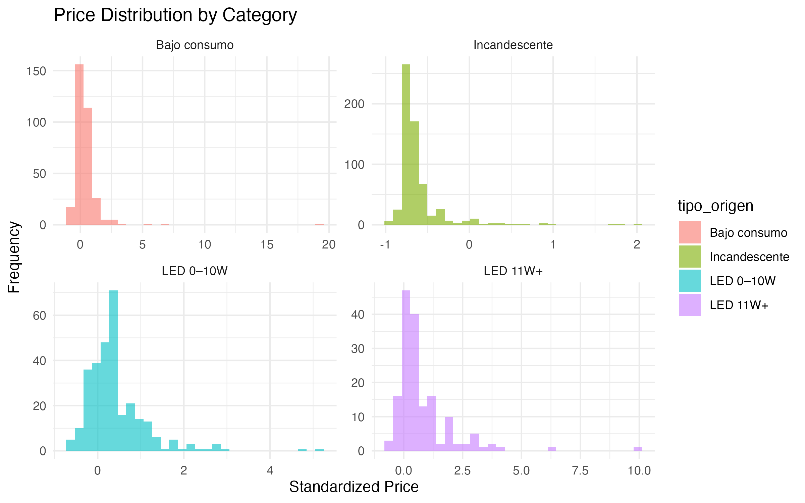
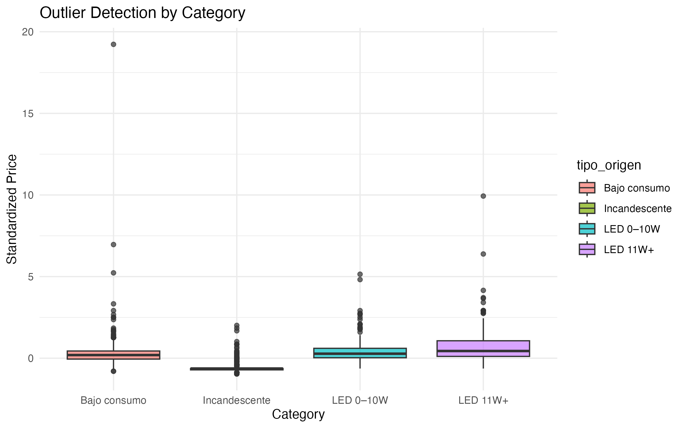
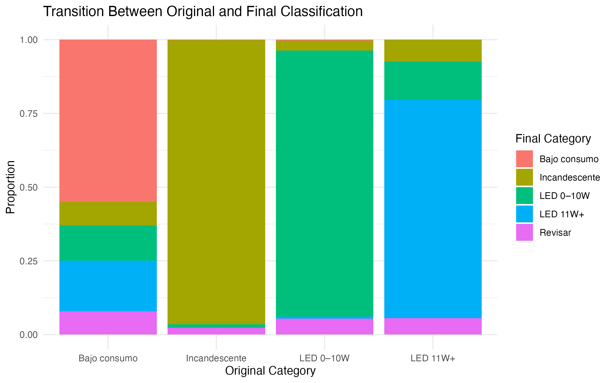
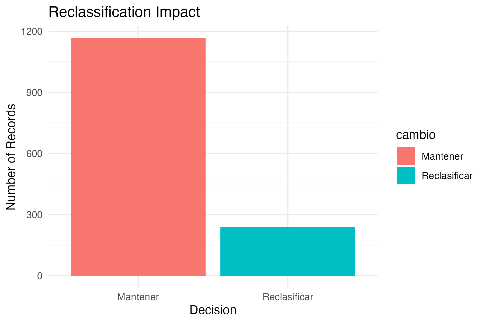
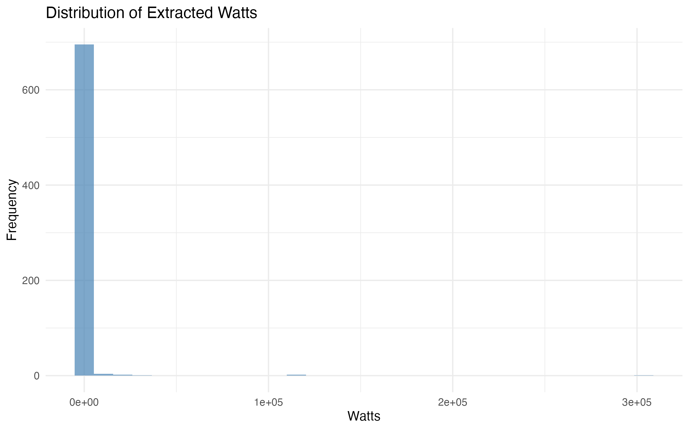

# 💡 Light Bulb Classification Model Using Multi-Criteria Analysis

## 📌 Overview

This project develops a rule-based classification model to detect inconsistencies in product categorization using multi-criteria analysis.

The model integrates statistical, textual, and technical variables to improve classification accuracy.

---

## 🎯 Key Results

- ✔ 17.13% of records were reclassified  
- ✔ Detection of inconsistencies in intermediate categories  
- ✔ Improved classification accuracy  

---

## ⚙️ Methodology

- Data cleaning and preprocessing  
- Price standardization (z-score normalization)  
- Brand normalization  
- Feature extraction (watts from text)  
- Outlier detection (IQR method)  
- Rule-based classification model  

---

## 📊 Key Visualizations

### Price Distribution

### Outlier Detection

### Classification Transition

### Model Results

### Watts Distribution

---

## 💡 Business Value

This model can be applied to:

- Data quality validation  
- Product classification systems  
- Market research  
- Survey data auditing  
- Pricing analysis  

---

## 🔐 Data Disclaimer

The dataset has been anonymized. Sensitive variables were removed and numerical values were transformed to preserve confidentiality.

---

## 🛠 Tools Used

- R (tidyverse, dplyr, ggplot2)  
- RMarkdown  
- Statistical analysis  
- Rule-based modeling  

---

## 📂 Project Structure

